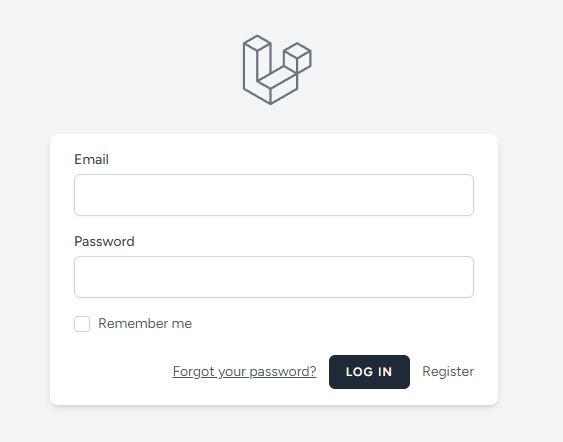
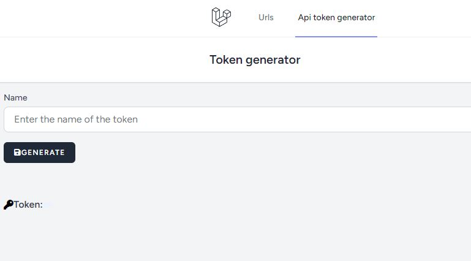

# Short Url Project


## Table of Contents

- [Introduction](#introduction)
- [Features](#features)
- [Installation](#installation)
- [Usage](#usage)
- [API Endpoints](#api-endpoints)

## Introduction

This project is a backend application built with [Laravel](https://laravel.com/docs/11.x/releases), utilizing [Breeze](https://laravel.com/docs/11.x/starter-kits) for authentication and [Blade](https://laravel.com/docs/11.x/blade) for templating. It provides a platform for users to create and manage shortened URLs, complete with user registration, authentication, and a URL overview dashboard. It also includes a API token generator for utilising CRUD operations of the provided API.

## Features

1. **User Registration and Login**: Users can register and log in.
2. **URL Dashboard**: Users can view all their shortened URLs.
3. **URL Manipulation Features**: Users can create, edit, and delete shortened URLs.
4. **Redirection Functionality**: The application allows redirection from the shortened URL to the target URL.
5. **API Functionality**: CRUD operations for URLs via an API endpoint.

## Requirements
- Composer installed
- NPM installed
- PHP 8.2 installed
- Node 18 installed

## Installation

1. Clone the repository:
    ```bash
    git clone https://github.com/KlaasTilman/short_url.git
    ```
2. Navigate to the project directory:
    ```bash
    cd short_url
    ```
3. Install the dependencies:
    ```bash
    composer install
    npm install
    npm run build
    ```
4. Copy the `.env.example` file to `.env`:
    ```bash
    cp .env.example .env
    ```
5. Generate the application key:
    ```bash
    php artisan key:generate
    ```
6. Run the database migrations:
    ```bash
    php artisan migrate
    ```
7. Serve the application:
    ```bash
    php artisan serve
    ```

## Usage

1. Register a new user or log in with existing credentials.

2. Access the URL management dashboard to view, create, edit, and delete shortened URLs.
3. Use the provided shortened URLs for redirection.

## API Endpoints

The application provides a set of API endpoints for managing URLs. These endpoints are secured with [Sanctum](https://laravel.com/docs/11.x/sanctum) for authentication. An API token is required for accessing these endpoints, which can be generated through a separate page in the project.

### Generate API Token

To generate an API token, navigate to the API token generation page after logging into the application. Use this token in your requests to access the protected endpoints.



### Get All URLs

**Endpoint:** `GET /api/urls`

**Description:** Retrieve all shortened URLs for the authenticated user.

**Response:**
```json
{
  "urls": [
    {
      "id": 1,
      "name": "Example URL",
      "og_url": "https://example.com",
      "short_url": "abcde",
      "user_id": 1,
      "created_at": "2024-06-05T12:34:56.000000Z",
      "updated_at": "2024-06-05T12:34:56.000000Z"
    }
    // more URLs
  ]
}
```

### Create a new URL

**Endpoint:** `POST /api/urls`

**Description:** Create a new shortened URL.

**Request parameters:**
- `name` (string, required): A descriptive name for the URL.
- `og_url` (string, required): The original URL to be shortened.

**Request example:**
```json
{
    "name": "Reddit",
    "og_url": "https://www.reddit.com/"
}
```

**Response:**
```json
{
  "message": "URL created successfully",
  "url": {
    "id": 2,
    "name": "Reddit",
    "og_url": "https://www.reddit.com/",
    "short_url": "fghij",
    "user_id": 1,
    "created_at": "2024-06-05T12:34:56.000000Z",
    "updated_at": "2024-06-05T12:34:56.000000Z"
  }
}
```

### Update an existing URL

**Endpoint:** `PUT /api/urls/{id}`

**Description:** Update an existing shortened URL.

**Request parameters:**
- `name` (string, required): A descriptive name for the URL.
- `og_url` (string, required): The original URL to be shortened.

**Request example:**
```json
{
    "name": "Reddit Part Two",
    "og_url": "https://www.reddit.com/"
}
```

**Response:**
```json
{
  "message": "URL updated successfully"
}
```

### Delete a URL

**Endpoint:** `DELETE /api/urls/{id}`

**Description:** Delete an existing shortened URL.

**Response:**
```json
{
  "message": "URL deleted successfully"
}
```